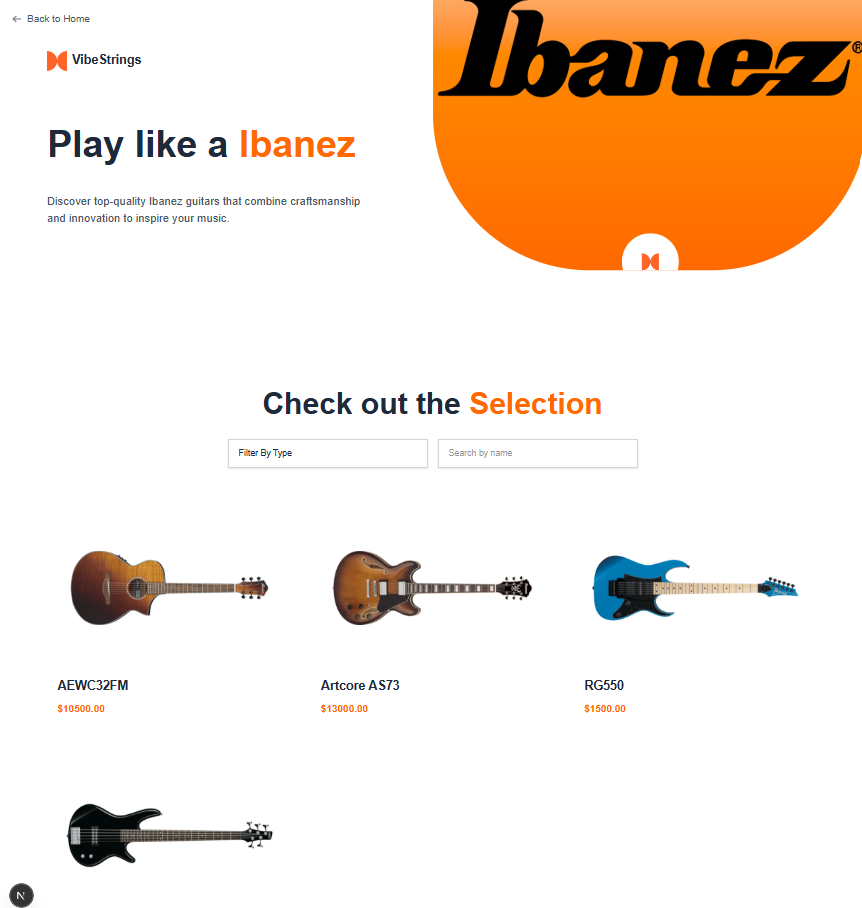
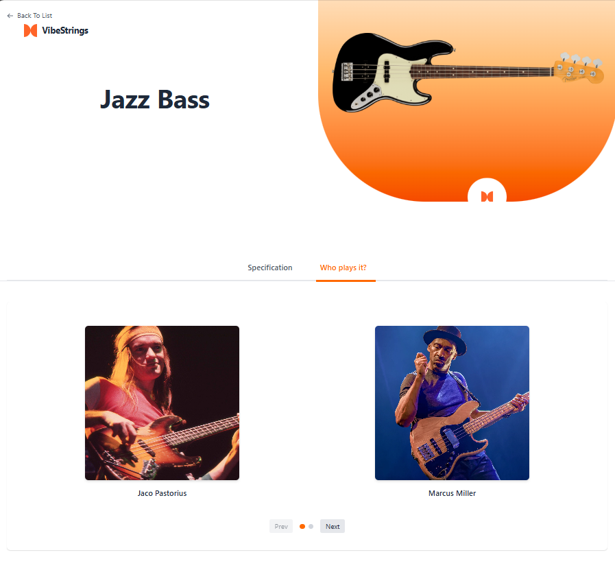

# VibeStrings - Online Guitar Shop 

<p align="center">
  <em>A modern, 3-page web application that allows users to browse a catalog of guitars from various brands and view detailed information about specific models.</em>
</p>

<p align="center">
  
  
  
</p>

---

##  Features

- **Browse Brands:** A homepage displaying a grid of top guitar brands.
- **View Models:** A dedicated page for each brand, listing all available guitar models.
- **Search & Filter:** Users can search for models by name and filter them by guitar type.
- **Infinite Scroll:** Model lists automatically load more items as the user scrolls down.
- **Model Details:** A detailed view for each guitar, including technical specifications and a list of famous musicians who play it.
- **Multi-Language Support:** The entire user interface can be switched between English and Albanian.
- **Responsive Design:** The application is fully responsive and optimized for a seamless experience on both desktop and mobile devices.

---

##  Screenshots

<div align="center">
  <table>
    <tr>
      <td valign="top"></td>
      <td valign="top"></td>
    </tr>
    <tr>
      <td colspan="2" align="center"></td>
    </tr>
  </table>
</div>

---

##  Getting Started

Follow these instructions to get a copy of the project up and running on your local machine for development and testing purposes.

### Prerequisites

You need to have Node.js and npm (or yarn) installed on your computer.
- [Node.js](https://nodejs.org/) (which includes npm)

### Installation

1.  **Clone the repository**
    ```bash
    git clone [https://github.com/Brikenda-Zogaj/VibeStrings-guitar-shop.git](https://github.com/Brikenda-Zogaj/VibeStrings-guitar-shop.git)
    ```

2.  **Navigate to the project directory**
    ```bash
    cd VibeStrings-guitar-shop
    ```

3.  **Install NPM packages**
    ```bash
    npm install
    ```

4.  **Run the development server**
    ```bash
    npm run dev
    ```

Open [http://localhost:3000](http://localhost:3000) with your browser to see the result.

---

##  Author

- **Brikenda Zogaj** - [GitHub Profile](https://github.com/Brikenda-Zogaj)
